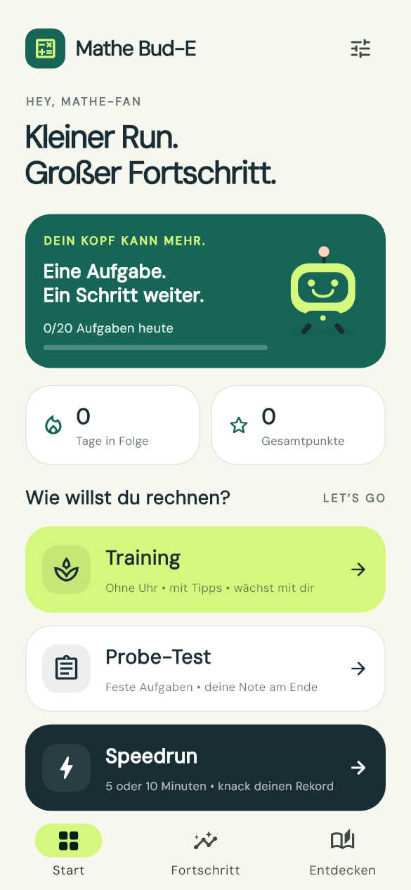
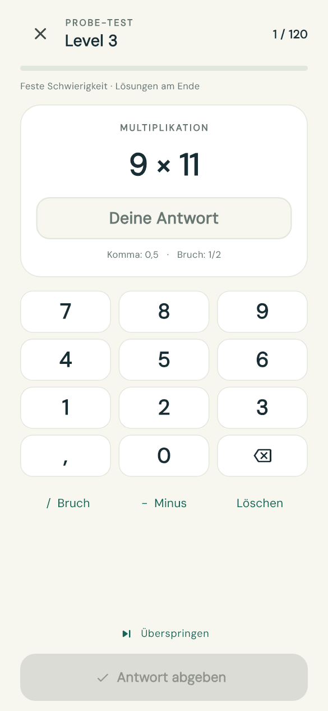

# Mathe Bud-E

**[⬇ Android-App herunterladen (APK)](https://github.com/christophschuhmann/mathe-bud-e/releases/latest/download/Mathe-Bud-E.apk)** · **[⬇ Windows-App herunterladen (ZIP)](https://github.com/christophschuhmann/mathe-bud-e/releases/latest/download/Mathe-Bud-E-Windows.zip)**

**Aktuelle Version: 1.1.0.** Die Links oben laden immer die neueste veröffentlichte APK beziehungsweise Windows-Version herunter. Neu: direkt überspringen, jederzeit Tipps holen und genau ein Punkt pro richtiger Antwort.

Die Downloads sind fertige App-Dateien. Du kannst sie ohne Programmierkenntnisse benutzen. Der Quellcode steht weiter unten im Repository; neue Versionen findest du bei [Releases](https://github.com/christophschuhmann/mathe-bud-e/releases). Um Android zu aktualisieren, lade die neue APK herunter und öffne sie: Android bietet „Aktualisieren“ an. Deinstalliere die vorhandene App vorher nicht, damit dein Fortschritt erhalten bleibt. Auf Windows ersetze den alten App-Ordner durch das neue entpackte Paket; der Fortschritt liegt separat im Benutzerprofil.

Ein deutscher Kopfrechentrainer mit Flutter für Windows und Android. Ohne Konto, Werbung oder Internetverbindung. Mit eigener Bildschirmtastatur, Hochformat auf Android und einer schmalen, skalierbaren Oberfläche auf Windows.

 

## Auf dem Android-Handy installieren

Eine **APK** ist die Installationsdatei für eine Android-App. Mathe Bud-E unterstützt Android 7.0 und neuer.

1. Öffne diese Seite auf deinem Android-Handy und tippe oben auf **„Android-App herunterladen (APK)“**.
2. Warte, bis **Mathe-Bud-E.apk** heruntergeladen wurde. Du findest sie in der Download-Meldung oder in der App **„Dateien“ / „Eigene Dateien“ → „Downloads“**.
3. Tippe auf **Mathe-Bud-E.apk**.
4. Falls Android nach einer Erlaubnis fragt, tippe auf **„Einstellungen“** und erlaube der verwendeten Browser- oder Datei-App **„Apps aus dieser Quelle installieren“**. Die genaue Bezeichnung hängt vom Handy ab. Gehe danach zurück zur Installationsdatei.
5. Tippe auf **„Installieren“** und anschließend auf **„Öffnen“**.
6. Später findest du **Mathe Bud-E** bei deinen Apps – am grünen Roboter-Symbol. Nach der Installation kannst du die Erlaubnis für Apps aus dieser Quelle wieder ausschalten.

Du kannst die APK auch am PC herunterladen und über ein USB-Kabel auf dein Handy kopieren. Öffne sie dort in der Datei-App. Eine APK ist für Android; auf einem iPhone ist sie nicht installierbar.

Diese erste Version wird direkt über GitHub verteilt und mit einem lokalen Entwicklungsschlüssel signiert. Sie ist keine Play-Store-Veröffentlichung. Die APK wurde gebaut und technisch geprüft; ein Test auf einem echten Android-Handy steht noch aus.

## Auf Windows starten

Für einen **Windows-10- oder Windows-11-PC mit 64 Bit**:

1. Klicke oben auf **„Windows-App herunterladen (ZIP)“**. Warte, bis **Mathe-Bud-E-Windows.zip** vollständig heruntergeladen wurde.
2. Öffne deinen Ordner **„Downloads“**.
3. Klicke mit der rechten Maustaste auf **Mathe-Bud-E-Windows.zip** und wähle **„Alle extrahieren …“**. Eine ZIP ist ein Paket, aus dem die App-Dateien ausgepackt werden.
4. Wähle einen gut auffindbaren Ordner, zum Beispiel einen neuen Ordner **„Mathe Bud-E“** auf deinem Desktop, und klicke auf **„Extrahieren“**.
5. Öffne den entpackten Ordner und doppelklicke auf **mathe_bud_e.exe**. Bei ausgeblendeten Dateiendungen heißt sie **mathe_bud_e** und hat den Typ **„Anwendung“**.
6. Das Startmenü erscheint. Du kannst sofort **Training**, **Probe-Test** oder **Speedrun** auswählen.

Bewahre den entpackten Ordner zusammen auf: Die App braucht die Dateien daneben und den Ordner **data**. Die benötigten C++-Laufzeitdateien liegen im Windows-Paket bei. Auf diesem Projekt-PC kannst du auch **Start-Mathe-Bud-E.cmd** doppelklicken.

Falls Windows beim Öffnen eine SmartScreen-Rückfrage zeigt: Prüfe, dass die Datei aus diesem Repository stammt und du ihr vertraust. Dann kannst du über **„Weitere Informationen“ → „Trotzdem ausführen“** starten, sofern Windows diese Möglichkeit anbietet. Bei einem verwalteten Schul- oder Firmen-PC kann die zuständige Administration die Installation freigeben.

## Deine ersten Aufgaben

1. Wähle **Training**, wenn du in Ruhe üben möchtest. Beginne mit **Level 1** oder wähle das passende Level. **Level 3** entspricht dem Kopfrechenblatt für Klasse 5/6.
2. Tippe die Antwort über die großen Zahlentasten ein. Am PC funktioniert auch die Tastatur.
3. Tippe auf **„Antwort prüfen“** und dann auf **„Weiter“**. Am PC geht beides mit **Enter**.
4. Wenn du Hilfe brauchst, tippe unten auf **„Tipp holen“**. Du kannst den Tipp vor dem Antworten öffnen. Nach einem Fehler gibt es **„Zeig mir, wie das geht“** mit einer einfachen Erklärung und Beispielschritten. Mit **„Überspringen“** kommst du sofort zur nächsten Aufgabe.
5. Mit **„Probe-Test“** bekommst du am Ende eine Note. Aktiviere dort **„Originaltest vom Foto“** für die 120 Aufgaben des Übungsblatts.
6. Mit **„Speedrun“** sammelst du in fünf oder zehn Minuten Punkte. Unter **„Fortschritt“** findest du deine Ergebnisse und Rekorde. Die Daten bleiben lokal auf dem jeweiligen Gerät.

**Kommazahlen:** `0,5` eingeben. **Brüche:** zum Beispiel `1/2` eingeben; die Taste **„/ Bruch“** setzt den Bruchstrich. **Korrigieren:** die Rücktaste löscht die letzte Ziffer, **„Löschen“** leert die ganze Antwort. Am PC werden Komma und Punkt sowie Backspace unterstützt.

## Modi

**Training:** Ohne Zeitlimit, Startlevel und Thema frei wählbar. Standardmäßig steigt das Level nach 8 richtigen Antworten in Folge und sinkt nach 5 Fehlern seit dem letzten Levelwechsel. Ein Fehler beendet die Erfolgsserie. Die Fehlersumme bleibt bis zum nächsten Levelwechsel bestehen. In den Einstellungen sind Aufstiegsschwellen von 5, 8 oder 10 und Abstiegsschwellen von 5 oder 10 wählbar. Bei einem einzelnen Thema sinkt das Level nur bis zu dessen Einstiegslevel. Gemischtes Training kann bis Level 1 zurückgehen. **„Tipp holen“** ist unten jederzeit vor dem Antworten erreichbar. Jede richtige Antwort zählt **genau einen Punkt**, auch mit Tipp. Eine mit Tipp gelöste Aufgabe setzt die Erfolgsserie für den Levelaufstieg zurück. **„Überspringen“** geht sofort zur nächsten Aufgabe; die übersprungene Aufgabe zählt als falsch und gibt keinen Punkt.

**Probe-Test:** Feste Schwierigkeit und beliebiges verfügbares Thema, 20, 40 oder 120 Aufgaben. Standardlevel 3. Der Schalter „Originaltest vom Foto“ verwendet die 120 abgetippten Aufgaben aus `20260917_071940.jpg` in der ursprünglichen Reihenfolge. Antworten und übersprungene Aufgaben werden nacheinander gespeichert; Lösungen und Erklärungen erscheinen erst in der Auswertung. Es gibt kein Zeitlimit. Ein vorzeitig beendeter Test bewertet alle noch unbeantworteten Aufgaben als falsch.

**Speedrun:** 5 oder 10 Minuten, immer gemischt ab Level 1. Einheitliche Schwellen: 8 richtige in Folge zum Aufstieg, 5 Fehler zum Abstieg. Pro richtiger Antwort gibt es **genau einen Punkt**, unabhängig vom Level und auch mit Tipp. Es gibt keinen Serienbonus. Überspringen ist möglich und zählt als Fehler ohne Punkt. Die Uhr läuft während Hilfen, Dialogen und im Hintergrund weiter. Vorzeitig beendete Runs werden protokolliert, zählen aber nicht als Rekord. Rekorde sind nach Laufdauer getrennt. Ein kopierbarer Ergebnistext erlaubt Vergleiche mit Freunden; es gibt keine Online-Rangliste.

## Zehn Levels

| Level | Inhalt |
| --- | --- |
| 1 | Plus/Minus bis 20, einfaches Einmaleins und Teilen |
| 2 | Zahlen bis 100 und kleines Einmaleins |
| 3 | Kopfrechnen Klasse 5/6 wie auf dem Foto, meist bis 300 |
| 4 | Größere Zahlen, Klammern und Punkt vor Strich |
| 5 | Kommazahlen, alle vier Grundrechenarten |
| 6 | Gleichnamige Brüche, Kürzen und Erweitern |
| 7 | Brüche mit unterschiedlichen Nennern |
| 8 | Brüche multiplizieren und dividieren |
| 9 | Prozentwerte und Prozentsätze |
| 10 | Mathe-Mix, Rabatte und Rückrechnung auf den Grundwert |

Alle Levels sind von Anfang an anwählbar. Die Rubrik „Entdecken“ bietet Beispiele mit verständlichen Rechenschritten und gefärbten Anteilen bei Brüchen und Prozenten. Bruchantworten dürfen grundsätzlich gleichwertige Brüche oder exakte Dezimalwerte sein. Bei „Kürze vollständig“ ist die gekürzte Form erforderlich, bei „Erweitere auf Nenner …“ der verlangte Nenner.

## Notenschema

Originale Mindestpunkte von **120**:

| Note | 1+ | 1 | 1− | 2+ | 2 | 2− | 3+ | 3 | 3− | 4+ | 4 | 4− | 5+ | 5 | 5− | 6 |
| --- | --- | --- | --- | --- | --- | --- | --- | --- | --- | --- | --- | --- | --- | --- | --- | --- |
| Ab Punkten | 90 | 85 | 80 | 75 | 70 | 65 | 60 | 55 | 50 | 45 | 40 | 35 | 30 | 25 | 20 | 0 |

Jede Aufgabe zählt einen Punkt. Kürzere Tests verwenden `richtig / Aufgaben × 120` ohne Rundung vor der Notenzuordnung. Beispiel: 46/120 ergibt **4+**, 15/20 entspricht 90/120 und ergibt **1+**. Die angezeigte Note ist eine Übungsnote nach diesem Blatt.

## Fortschritt

Seit Version 1.1 gilt in allen Modi ein Punkt pro richtiger Antwort. Beim ersten Start der neuen Version werden alte Gesamtpunkte und Run-Punktzahlen automatisch anhand der gespeicherten richtigen Antworten auf diese Wertung umgerechnet. Ergebnisse, Einstellungen und Level bleiben erhalten.

Antworten, Gesamtpunkte, höchste erreichte Stufe, Themenquoten, aktive Tage, Einstellungen und die letzten 100 Runs werden lokal mit `shared_preferences` gespeichert. Windows und Android haben jeweils ihren eigenen Fortschritt; es gibt keine Cloud-Synchronisation. Antworten werden während des Runs gespeichert, die Run-Zusammenfassung beim Abschließen. Beim Beenden des Prozesses mitten im Run bleiben bereits gespeicherte Antwortstatistiken erhalten, es entsteht aber keine abgeschlossene Run-Zusammenfassung.

## Entwickeln und bauen

Erstellt mit Flutter 3.32.1 / Dart 3.8.1. Pakete sind in `pubspec.lock` festgehalten. Schrift und Icons sind lokal enthalten. Die DM-Sans-Lizenz steht in `assets/fonts/OFL.txt`.

```powershell
flutter pub get
flutter analyze
flutter test --concurrency=1
flutter run -d windows
flutter build windows --release
flutter build apk --release --no-shrink
```

`tools/Build.ps1` findet auch die vorhandene Flutter-Installation unter dem Benutzerprofil oder `C:/dev/flutter`, führt die Prüfungen aus, baut beide Plattformen und legt die verteilbaren Dateien in `dist/` ab.

Windows benötigt die Visual-Studio-C++-Build-Tools. Android benötigt ein eingerichtetes Android-SDK, Java 17 und NDK 27.0.12077973. Offizielle Einrichtung: [Windows](https://docs.flutter.dev/platform-integration/windows/setup), [Android](https://docs.flutter.dev/platform-integration/android/setup). Ein zusätzlicher Web-Runner liegt für die Entwicklung bei.

## Prüfung

Version 1.1: **21 automatisierte Tests bestanden**, darunter Überspringen in allen Modi, ein Punkt je richtiger Antwort mit und ohne Tipp sowie die Umrechnung alter Punktestände. Codeanalyse ohne Befund.

Automatisierte Tests prüfen exakte Antworterkennung, das gesamte Originalblatt, alle Notengrenzen, adaptive Levelwechsel, mehrere tausend generierte Aufgaben, Bruchformen und das Speichern/Neuladen des Fortschritts. Bedienungstests führen alle 120 Originalaufgaben über die PC-Tastatur durch und prüfen kleine Bildschirme, Rechenhilfen, Abbrüche und den Timerablauf bei geöffneter Hilfe. Screenshots aus den Flutter-Bedienungstests liegen in `artifacts/screenshots/`. Die Release-Dateien werden für Windows und Android kompiliert; ein Test auf einem echten Android-Handy steht noch aus.
